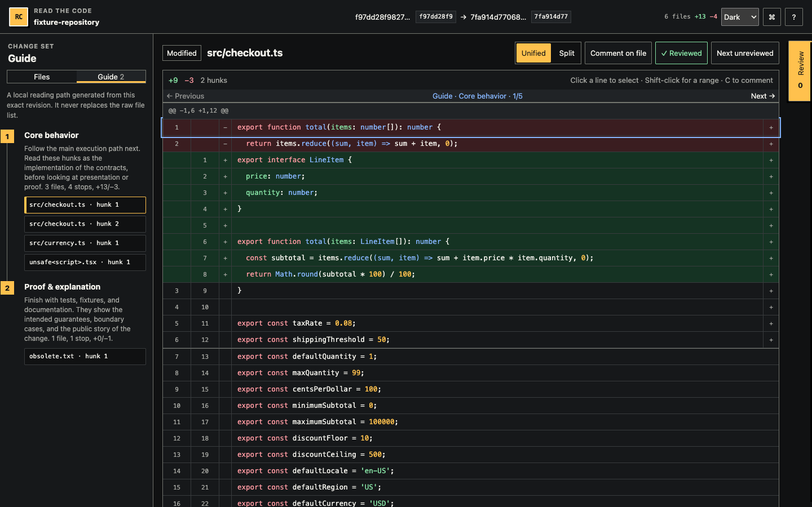

# Read the Code

Review an exact local Git change set in a focused browser UI—without pushing a branch or opening a pull request.

Read the Code is a standalone, local-first product. `read-the-code-axi` resolves immutable base and head commits, starts an authenticated loopback server, and opens a polished review surface for file navigation, unified or split diffs, line and general comments, batched feedback, and exact-revision approval. The same versioned records power the browser and the CLI.



## Quick start

Node.js 20.12 or newer and Git are required.

```bash
npx -y read-the-code-axi open \
  --repo /path/to/repository \
  --base main \
  --head feature/my-change
```

The package is not published as part of this repository foundation. From a clone, use:

```bash
npm install
npm run build
npx read-the-code-axi open --repo . --base main --head HEAD
```

`open` resolves both refs before creating the review. Repeating the command for the same repository and SHAs resumes the same session idempotently. Its normal response is compact TOON and confirms the local browser launch without echoing the bearer URL. Use `--no-browser --json` only when an agent needs the versioned capability-bearing machine record.

## Agent integration

The canonical [Read the Code skill](skills/read-the-code/SKILL.md) follows the open [Agent Skills specification](https://agentskills.io/specification). It teaches coding agents to manage the exact-revision CLI lifecycle, durable cursors, untrusted feedback, capability secrecy, recovery, and exact-head approval without depending on a pull request or a vendor-specific control plane.

Install the skill from a public source checkout by copying or linking the complete directory into a supported skill location:

```bash
git clone --depth 1 https://github.com/kvkenyon/read-the-code.git
mkdir -p "$HOME/.agents/skills"
ln -s "$PWD/read-the-code/skills/read-the-code" "$HOME/.agents/skills/read-the-code"
```

The npm tarball also carries the directory. After installing a local or published package, copy it directly from the package:

```bash
npm install /path/to/read-the-code-axi-0.1.0.tgz
mkdir -p .agents/skills
cp -R node_modules/read-the-code-axi/skills/read-the-code .agents/skills/read-the-code
```

Use the destination recognized by the agent client and desired scope:

| Client                                           | Project skill                  | Personal skill                     |
| ------------------------------------------------ | ------------------------------ | ---------------------------------- |
| Portable convention, Codex, VS Code, Copilot, pi | `.agents/skills/read-the-code` | `~/.agents/skills/read-the-code`   |
| Claude Code                                      | `.claude/skills/read-the-code` | `~/.claude/skills/read-the-code`   |
| GitHub Copilot native alternative                | `.github/skills/read-the-code` | `~/.copilot/skills/read-the-code`  |
| pi native alternative                            | `.pi/skills/read-the-code`     | `~/.pi/agent/skills/read-the-code` |

These locations are documented by [Agent Skills](https://agentskills.io/client-implementation/adding-skills-support), [Codex](https://developers.openai.com/codex/build-skills), [Claude Code](https://code.claude.com/docs/en/skills), [GitHub Copilot](https://docs.github.com/en/copilot/how-tos/copilot-on-github/customize-copilot/customize-cloud-agent/add-skills), and [pi](https://github.com/badlogic/pi-mono/blob/main/packages/coding-agent/docs/skills.md). Client discovery rules evolve; prefer the client-native path above if a particular version does not scan `.agents/skills`.

The skill expects `read-the-code-axi` on `PATH`. The npm package is not published by this repository change; from a trusted checkout, run `npm install`, `npm run build`, and `npm link`, or install a locally produced tarball. Once a release is published, `npm install --global read-the-code-axi` is the direct CLI install.

Example prompt:

> Use $read-the-code to open the exact `main...HEAD` diff for local human review, process durable feedback, and treat approval only as exact-head evidence.

## CLI

```text
read-the-code-axi open --repo <path> --base <ref> --head <ref> [--no-browser] [--json]
read-the-code-axi status <session> [--json]
read-the-code-axi poll <session> [--after <cursor>] [--timeout <duration>] [--full] [--json]
read-the-code-axi export <session> [--diagnostic] [--full] [--json]
read-the-code-axi end <session> [--json]
```

### AXI output contract

Running `read-the-code-axi` with no arguments is a content-first home view: executable location, a short description, up to five recent sessions, aggregates, an explicit `sessions: []` empty state, and next commands. Ordinary commands return official TOON by default, with minimal summaries, bounded comment/path previews, aggregate activity, and contextual `help[]`. `poll` calls out `waiting`, `feedback`, `approval`, `approval-stale`, and `ended` instead of requiring inference from an empty response.

Use `--full` for complete TOON event/export content. Use explicit `--json` for typed processing: JSON remains the stable `schemaVersion: 1` contract for Sophon and other durable consumers, including exact session identity, cursor continuity, full events, and capability-bearing `open` results. Default TOON is intentionally a concise agent-facing view, not a replacement for that protocol. Default failures are structured TOON on stdout; `--json` failures retain the versioned JSON error record on stderr. Unknown commands and flags exit 2.

Durations accept `ms`, `s`, or `m`, such as `500ms`, `30s`, and `2m`. The packed-product smoke test decodes every default response with the official TOON decoder, exercises the full lifecycle in both surfaces, and requires the bounded default export to be at least 10% smaller than its complete JSON counterpart. Its representative hostile-comment fixture currently measures 1,991 B TOON versus 7,954 B JSON (75% smaller), demonstrating the practical token-saving direction without making a tokenizer-specific claim.

### Agent loop

`poll` never deletes events. Every feedback batch, approval, and end event has a durable, monotonically increasing `sequence`. Store `nextCursor` only after processing the returned events, then pass it back with `--after`; restarting a polling process cannot lose queued feedback.

```bash
review=$(read-the-code-axi open \
  --repo "$PWD" --base main --head HEAD --no-browser --json)
session=$(printf '%s' "$review" | jq -r .sessionId)
cursor=0

while true; do
  result=$(read-the-code-axi poll "$session" --after "$cursor" --timeout 2m --json)
  printf '%s\n' "$result" | jq '.events[]'
  cursor=$(printf '%s' "$result" | jq -r .nextCursor)
  printf '%s' "$result" | jq -e '.events[] | select(.type == "end")' >/dev/null && break
done

read-the-code-axi export "$session" --json > review-record.json
```

Use default TOON for a human-readable shell check, for example `read-the-code-axi status <session>` or `read-the-code-axi poll <session> --after <cursor>`. Machine consumers, including Sophon, should use JSON and treat these exit codes as stable categories:

| Exit | Meaning                                        |
| ---: | ---------------------------------------------- |
|    0 | Success, including poll timeout                |
|    2 | Invalid argument, ref, anchor, or request      |
|    3 | Git operation failed                           |
|    4 | Configured size limit exceeded                 |
|    5 | Concurrent session operation stayed busy       |
|    6 | Session not found                              |
|    7 | Corrupt local state                            |
|    8 | Ended or stale revision conflict               |
|    9 | Authorization, origin, host, or bind rejection |
|   10 | Local server failed to start                   |

## Review experience

- Searchable changed-file navigation with reviewed state and comment counts.
- Unified and split syntax-highlighted diffs with additions, deletions, context, hunks, line numbers, renamed/deleted/added files, binary notices, and explicit large-file containment.
- Click a line to comment; Shift-click another line on the same side for a range.
- Editable draft comments, file comments, and general comments submitted together as one durable feedback event.
- Explicit approval bound to the displayed head SHA and a separate end-review action.
- Stale-head warning and invalidated approval state when the requested head ref moves.
- Keyboard navigation: <kbd>J</kbd>/<kbd>K</kbd> files, <kbd>U</kbd>/<kbd>S</kbd> layout, <kbd>G</kbd> general comment, and <kbd>Esc</kbd> cancel.
- Responsive file drawer and horizontally contained diffs on narrow screens.

The browser cannot edit or write source files.

## Privacy and security model

Normal operation makes no network requests beyond loopback. Frontend assets and syntax grammars are bundled in the npm package; there are no CDN assets, analytics, accounts, telemetry, cloud storage, or publishing service.

- The HTTP server binds only to `127.0.0.1` on an operating-system-assigned port.
- Each review has a random 256-bit capability token. The token is kept in a private state file and the browser URL fragment, so it is not sent in the initial HTTP request. APIs require it as a bearer capability.
- Server management uses a separate private capability. Tokens are never written into exports or server logs.
- Browser writes validate Host, Origin, content type, payload size, session capability, exact revision, path, side, line range, and contextual anchor hashes.
- Git is invoked directly without a shell, with external diff/text conversion disabled. Repository content is rendered as escaped text and is never executed.
- The browser API can only return the stored manifest and patch fragments for that review. It has no arbitrary filesystem endpoint.
- Sessions live under `$XDG_STATE_HOME/read-the-code` or `~/.local/state/read-the-code`; set `READ_THE_CODE_STATE_DIR` to override this for tests or isolated automation.
- Browser and machine exports omit absolute local paths. `export --diagnostic` is the explicit opt-in for the local repository path.

The authenticated local URL is a bearer capability. Share it only with processes and people who should access the review.

## Limits

This first release reviews two committed Git trees. It does not include unstaged changes, inline source editing, hosted sharing, remote collaboration, or PR synchronization. Patches are limited to 1 MB per file, 8 MB total, and 2,000 files. Binary contents are not rendered. Individual comments are limited to 20 KB and a batch to 100 comments/100 KB.

File review checkmarks are browser-local convenience state. Submitted comments, approvals, end events, and their cursors are durable session state.

## Development

```bash
npm install
npm run fixture        # creates .test-state/example-repository
npm run dev            # frontend development only
npm run check          # format, lint, types, unit/integration, build, packed install
npm run test:skill     # skill format, CLI help contract, examples, and links
npm run test:e2e       # real Chromium review workflow
npm run release:check  # complete local release gate and npm pack dry run
```

See [architecture](docs/architecture.md), [typed protocol](docs/protocol.md), and [contributing](CONTRIBUTING.md) for implementation details. Read the Code is available under the [MIT License](LICENSE).
